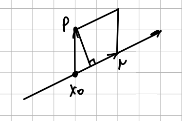

# Контрольная работа 2022-2023

## Задание 1

:::{note} Условие
Рассмотрим линейное отображение $\phi\colon \R[x]_{\leq3}\mapsto \R^3, f\mapsto(f'(-1), f''(-1), f(1))$. Найдите базис $\ebase$ пространства $\R^3$, в которых $\,\phi\,$ имеет диагональный вид с единицами и нулями на диагонали, и выпишите этот вид.
::: 

:::{seealso} Решение
$\exists$ линейное отображение $\phi\colon V\to W$.

$\exists \ker\phi\in V=\langle e_{r_+1},\dots,e_n\rangle$. Дополним ядро до $\langle e_1,\dots,e_r,e_{r+1},\dots, e_n\rangle=V$ — базис отображения.

$\exists \Im\phi\in W=\langle\phi(e_1),\dots,\phi(e_r)\rangle$. Дополним образ до $\langle\phi(e_1),\dots,\phi(e_r),f_{r+1},\dots,f_m\rangle$, где $f_1=\phi(e_1),\dots,f_r=\phi(e_r)$

$\R[x]_{\leq 3}\mapsto\R^3, \phi\colon f\mapsto(f'(-1),f''(-1),f(-1))$

---

Посчитаем значения $\,\phi\,$ для базисных векторов $1, x, x^2, x^3$:

$$\phi(1)=(0,0,1)=f_1,\quad\phi(x^2)=(-2,2,1)=f_3,\\\quad\phi(x)=(1,0,1)=f_2,\quad\phi(x^3)=(3,-6,1)=f_4$$

Теперь выписываем УСВ:

$$\begin{pmatrix}
    0 & 1 & -2 & 3\\
    0 & 0 & 2 & -6\\
    1 & 1 & 1 & 1
\end{pmatrix}\leadsto\begin{pmatrix}
    0 & 1 & 0 & -3\\
    0 & 0 & 1 & -3\\
    1 & 1 & 0 & 4
\end{pmatrix}\leadsto\begin{pmatrix}
    0 & 1 & 0 & -3\\
    0 & 0 & 1 & -3\\
    1 & 0 & 0 & 7
\end{pmatrix}\leadsto\\
\stackrel{d\quad c\quad\ b\quad\ \ \  a \ }{\begin{pmatrix}
    1 & 0 & 0 & 7\\
    0 & 1 & 0 & -3\\
    0 & 0 & 1 & -3
\end{pmatrix}}\implies\begin{align*}
    &c=3a\\
    &b=3a\\
    &d=-7a
\end{align*}$$

Чётвертая координата свободна, выписываем ФСР:

$$\Phi=\overset{\small{\ \ \ d\ \  c\ \  b\ \  a}}{(-7,3,3,1)}$$

Теперь этот вектор нужно дополнить до базиса пространства:

$$\begin{align*}
(-7,3,3,1)\\
(0,0,1,0)\\
(0,1,0,0)\\
(1,0,0,0)
\end{align*}$$

т. е. мы нашли $\langle e_1,\dots,e_r,e_{r+1},\dots,e_n\rangle$

$$\begin{align*}
    &e_4=x^3+3x^2+3x-7\\
    &e_3=x^2\\
    &e_2=x\\
    &e_1=1
\end{align*} - \text{базис в исходном пространстве}$$

Тогда базис в $\R^3\colon\langle f_1,f_2,f_3\rangle$ и матрица отображения будет:

$$\begin{pmatrix}
    1 & 0 & 0 & 0\\
    0 & 1 & 0 & 0\\
    0 & 0 & 1 & 0
\end{pmatrix}$$

:::

## Задание 2

:::{note} Условие
Пусть $V$ — пространство всех верхнетреугольных матриц размера $2\times 2$ с коэффициентами из $\R,S=\begin{pmatrix}1 & 2\\ - 3&0\end{pmatrix},\ v=(1,-1)$. Рассмотрим на $V$ линейные функции $\alpha_1,\alpha_2,\alpha_3$, где

$$\alpha_1(X)=\tr(X),\quad\alpha_2(X)=\tr(XS),\quad\alpha_3(X)=vXv^T,\quad \forall X\in V$$

Найдите базис пространства $V$, для которого набор $(\alpha_1,\alpha_2,\alpha_3)$ является двойственным базисом пространства $V^*$.
:::

:::{seealso}
Введём стандартный базис всех верхнетреугольных матриц:
$$e_1=\stackrel{\displaystyle a}{\begin{pmatrix}
1 & 0\\
0 & 0
\end{pmatrix}},\quad e_2=\stackrel{\displaystyle b}{\begin{pmatrix}
0 & 1\\
0 & 0
\end{pmatrix}},\quad e_3=\stackrel{\displaystyle c}{\begin{pmatrix}
0 & 1\\
0 & 0
\end{pmatrix}}$$

Перейдём к координатам:

$$X=\begin{pmatrix}
    a & b\\
    0 & c
\end{pmatrix}$$

$$XS=\begin{pmatrix}
    a & b\\
    0& c\\
\end{pmatrix}\begin{pmatrix}
    1 & 2\\
    -3 & 0\\
\end{pmatrix}=\begin{pmatrix}
    a - 3b & 2a\\
    -3c & 0
\end{pmatrix}
$$

$$vXb^T=\begin{pmatrix}
    1 & -1\\
\end{pmatrix}\begin{pmatrix}
    1 & 2\\
    -3 & 0
\end{pmatrix}\begin{pmatrix}
    1\\
    -1
\end{pmatrix}=\begin{pmatrix}
    1 & -1\\
\end{pmatrix}\begin{pmatrix}
    a - b\\
    -c
\end{pmatrix}=a-b+c$$

Теперь векторы базиса:

$$\begin{align*}
&\eps_1=\alpha_1(X)=\tr(X)=a+c\\
&\eps_2=\alpha_2(X)=\tr(XS)=a-3b\\
&\eps_3=\alpha_3(X)=vXv^T=a-b+c
\end{align*}$$

Есть двойственный базис, ищем исходный к нему:

$$\begin{matrix}
    \alpha_1(e_1)=1 & \alpha_1(e_2)=0 & \alpha_1(e_3)=0\\
    \alpha_2(e_1)=0 & \alpha_2(e_2)=1 & \alpha_2(e_3)=0\\
    \alpha_3(e_1)=0 & \alpha_3(e_2)=0 & \alpha_3(e_3)=1
\end{matrix}$$

$$\begin{cases}
a+c=1\\
a-3b=0\\
a-b+c=0
\end{cases}\quad\begin{cases}
a+c=0\\
a-3b=1\\
a-b+c=0
\end{cases}\quad\begin{cases}
a+c=0\\
a-3b=0\\
a-b+c=1
\end{cases}$$

$$\begin{pmatrix}
        & & & & e_1& e_2& e_3\\
    1 & 0 & 1 & \bigm| & 1 & 0 & 0\\
    1 & -3 & 0 & \bigm| & 0 & 1 & 0\\
    1 & -1 & 1 & \bigm| & 0 & 0 & 1\\
\end{pmatrix}\leadsto\begin{pmatrix}
    & & & & & e_1& e_2& e_3\\
    1 & 0 & 0 & \bigm| & a& 3 & 1 & -3\\
    0 & 1 & 0 & \bigm| & b&1 & 0 & -1\\
    0 & 0 & 1 & \bigm| & c&-2 & -1 & 3\\
\end{pmatrix}$$

Можно сделать проверку:

$$\begin{cases}
3-2=1\\
3-3=0\\
3-1-2=0
\end{cases}\quad\begin{cases}
1-1=0\\
1-0=1\\
1-0-1=0
\end{cases}\quad\begin{cases}
-3+3=0\\
-3+3=0\\
-3+1+3=1
\end{cases}$$

Запишем наш ответ в терминах матриц:

$$e_1=\begin{pmatrix}
3 & 1\\
0 & -2
\end{pmatrix},\quad e_2=\begin{pmatrix}
    1 & 0\\
    0 & -1
\end{pmatrix},\quad e_3=\begin{pmatrix}
    -3 & 1\\
    0 & 3
\end{pmatrix}$$

:::

## Задание 3

:::{note} Условие

Билинейная форма $\,\beta\,$ на пространстве $\R^3$ имеет в стандартном базисе матрицу $\begin{pmatrix}0 & 0 & 4\\
1 & 0 & 3\\
-4 & 1 & 0\end{pmatrix}$. Найдите невырожденную замену координат (выражение старых координат через новые), приводящую квадратичную форму $Q(x)=\beta(x,x)$ к нормальному виду, и выпишите этот вид.

:::

:::{seealso} Решение

$\beta\colon\R^3\times\R^3\mapsto\R$, как выглядит квадратичная форма $Q(x),\beta(\bar{x},\bar{y})$?

$$\begin{pmatrix}x_1 &x_2&x_3\end{pmatrix}\begin{pmatrix}
    0 & 0 & 4\\
    1 & 0 & 3\\
    -4 & 1 & 0
\end{pmatrix}\begin{pmatrix}
    y_1\\
    y_2\\
    y_3
\end{pmatrix}=\begin{pmatrix}x_1 &x_2&x_3\end{pmatrix}\begin{pmatrix}
    4y_3\\
    y_1+3y_3\\
    -4y_1+y_2
\end{pmatrix}=\\4y_3x_1+x_2y_1+3y_3x_2+x_3y_2-4y_1x_2$$

$$\beta(\bar x,\bar y)=\beta((x_1,x_2,x_3),(y_1,y_2,y_3))$$

$$Q(x)=\cancel{4x_3x_1}+x_2x_1+3x_3x_2+x_3x_2-\cancel{4x_1x_3}=x_1x_2+4x_2x_3$$

Матрица квадратичной формы:

$$\begin{pmatrix}
    0 & \frac{1}{2} & 0 & \bigm| & 1 & 0 & 0\\
    \frac{1}{2} & 0 & 2 & \bigm| & 0 & 1 & 0\\
    0 & 2 & 0 & \bigm| & 0 & 0 & 1
\end{pmatrix}$$

Матрица перехода к тому базису, в котором будет нужное выражение:

$$\overbrace{(U^T_k\dots U_2^TU_1^T)}^{U^T}C\overbrace{(U_1U_2\dots U_k)}^U=\underbrace{U^TCU}_{\text{живёт в}\ \ebase}=\underbrace{D}_{\text{живёт в}\ \ebase'}$$

Нужно выразить старые координаты через новые:
$$\underbrace{\ebase'}_{x'}=\underbrace{\ebase U}_x,\quad x=Ux'$$

Применим элементарные преобразования и симметричного Гаусса. В обоих частях матрицы применяем преобразования строк, но только в левой части преобразования столбцов.

$$\begin{pmatrix}
    0 & \frac{1}{2} & 0 & \bigm| & 1 & 0 & 0\\
    \frac{1}{2} & 0 & 2 & \bigm| & 0 & 1 & 0\\
    0 & 2 & 0 & \bigm| & 0 & 0 & 1
\end{pmatrix}\leadsto\begin{pmatrix}
    1 & \frac{1}{2} & 2 & \bigm| & 1 & 0 & 0\\
    \frac{1}{2} & 0 & 2 & \bigm| & 1 & 1 & 0\\
    2 & 2 & 0 & \bigm| & 0 & 0 & 1
\end{pmatrix}\leadsto\\
\begin{pmatrix}
    1 & \frac{1}{2} & 0 & \bigm| & 1 & 0 & -2\\
    \frac{1}{2} & 0 & 1 & \bigm| & 1 & 1 & -2\\
    0 & 1 & -4 & \bigm| & 0 & 0 & 1
\end{pmatrix}\leadsto\begin{pmatrix}
    1 & 0 & 0 & \bigm| & 1 & -\frac{1}{2} & -2\\
    0 & -\frac{1}{4} & 1 & \bigm| & 1 & \frac{1}{2} & -2\\
    0 & 1 & -4 & \bigm| & 0 & 0 & 1
\end{pmatrix}\leadsto\\\begin{pmatrix}
    1 & 0 & 0 & \bigm| & 1 & -\frac{1}{2} & -4\\
    0 & -\frac{1}{4} & 0 & \bigm| & 1 & \frac{1}{2} & 0\\
    0 & 0 & 0 & \bigm| & 0 & 0 & 1
\end{pmatrix}\leadsto\begin{pmatrix}
    1 & 0 & 0 & \bigm| & 1 & -1 & -4\\
    0 & -1 & 0 & \bigm| & 1 & 1 & 0\\
    0 & 0 & 0 & \bigm| & 0 & 0 & 1
\end{pmatrix}$$

Получили матрицу перехода от новых координат к старым (правая часть матрицы это матрица $U$). В новом базисе нормальный вид квадратичной формы будет $x_1'^2-x_2'^2$.

$$\begin{pmatrix}
x_1\\
x_2\\
x_3
\end{pmatrix}=\begin{pmatrix}
    1 & -1 & -4\\
    1 & 1 & 0\\
    0 & 0 & 1
\end{pmatrix}\begin{pmatrix}
    x_1'\\
    x_2'\\
    x_3'
\end{pmatrix}\implies\begin{cases}
    x_1=x_1'-x_2'-4x_3'\\
    x_2=x_1'+x_2'\\
    x_3=x_3'
\end{cases}$$

Сделаем проверку:

$$x_1x_2+4x_2x_3=(x_1'-x_2'-4x_3')(x_1'+x_2')+4(x_1'+x_2')x_3'=\\(x_1'+x_2')(x'_1-x'_2-4x_3'+4x'_3)=(x'_1+x'_2)(x_1'-x_2')=x_1'^2-x_2'^2$$

---

Если хотим выразить новые координаты через старые, то нужно найти обратную матрицу $U^{-1}$. Тогда получим новые координаты:

$$\begin{pmatrix}
x_1'\\
x_2'\\
x_3'
\end{pmatrix}=\begin{pmatrix}
    \frac{1}{2} & \frac{1}{2} & 2\\
    -\frac{1}{2} & \frac{1}{2} & -2\\
    0 & 0 & 1
\end{pmatrix}\begin{pmatrix}
    x_1\\
    x_2\\
    x_3
\end{pmatrix}\implies\begin{cases}
    x_1'=\frac{1}{2}x_1+\frac{1}{2}x_2+2x_3\\
    x_2'=-\frac{1}{2}x_1+\frac{1}{2}x_2-2x_3\\
    x_3'=x_3'
\end{cases}$$

Опять сделаем проверку:

$$x_1^2-x_2^2=\left(\frac{1}{2}x_1+\frac{1}{2}x_2+2x_3\right)^2-\left(-\frac{1}{2}x_1+\frac{1}{2}x_2-2x_3\right)^2=\\\left(\frac{1}{2}x_1+\frac{1}{2}x_2+2x_3-\frac{1}{2}x_1+\frac{1}{2}x_2-2x_3\right)\left(\frac{1}{2}x_1+\frac{1}{2}x_2+2x_3+\frac{1}{2}x_1-\frac{1}{2}x_2+2x_3\right)=\\x_2(x_1+4x_3)=x_1x_2+4x_2x_3
$$

:::

## Задание 4

:::{note} Условие
Определите нормальный вид квадратичной формы 

$$Q(x_1,x_2,x_3)=x_1^2+ax_2^2+2x_3^2+4x_1x_2-2x_1x_3$$

в зависимости от значений параметра $a$.
:::

:::{seealso} Решение

Выпишем матрицу квадратичной формы и применим симметричные элементарные преобразования, чтобы переставить 2-ю и 3-ю строки местами. **Всегда проще отправить параметр как можно дальше от первых миноров.**

$$\begin{pmatrix}
    1 & 2 & -1\\
    2 & a & 0\\
    -1 & 0 & 2
\end{pmatrix}\leadsto\begin{pmatrix}
    1 & -1 & 2\\
    -1 & 2 & 0\\
    2 & 0 & a
\end{pmatrix}$$

Теперь посчитаем миноры:

$$\delta_1=1,\quad\delta_2=\begin{vmatrix}1&-1\\-1&2\end{vmatrix}=1\times2-(-1)\times(-1)=1\\\delta_3=\begin{vmatrix}
    1 & -1 & 2\\
    -1 & 2 & 0\\
    2 & 0 & a
\end{vmatrix}=1\times2\times a-2^3-a=a-8$$

Тогда канонический вид по сути это 

$$\delta_1x^2_1+\frac{\delta_2}{\delta_1}x_2^2+\frac{\delta_3}{\delta_2}x_3^2=x^2_1+x_2^2+(a-8)x_3^2$$

Рассматриваем три случая и выписываем нормальный вид для каждого:

$$\begin{cases}
    x_1^2+x_2^2,\qquad\quad\, a=8\\
    x_1^2+x_2^2+x_3^2,\quad a > 8\\
    x_1^2+x_2^2-x_3^2,\quad a < 8
\end{cases}$$

:::

## Задание 5

:::{note} Условие

Пусть $L\subseteq\R^4$ — подпространство, задаваемое уравнением $x_1+2x_2-2x_3+x_4=0$. Дополните вектор $v=\frac{1}{2}(1,1,1,-1)$ до ортонормированного базиса в $L$.

:::

:::{seealso} Решение

Проверим, что вектор принадлежит подпространству, подставив его координаты в уравнение:

$$x_1+2x_2-2x_3+x_4=1+2-2-1=0$$

Выразим какую-нибудь переменную через остальные, найдя ФСР:

$$x_1=-2x_2+2x_3-x_4$$

Всего 1 главная переменная и 3 свободных, следовательно размерность базиса 3. Подберём просто какие-то векторы, система которых линейно независима с данным:

$$\begin{matrix}
    & x_1 & x_2 & x_3 & x_4\\
    e_1 & \frac{1}{2} & \frac{1}{2} & \frac{1}{2} & -\frac{1}{2}\\
    e_2 & 2 & 0 & 1 & 0\\
    e_3 & -2 & 1 & 0 & 0
\end{matrix}$$

Теперь применим метод ортогонализации Грама-Шмидта. Он работает для любых систем векторов, отбирая ЛНЗ вектора.

$$f_{k+1}=e_{k+1}-\sum^k_{i=1}\frac{(e_{k},f_i)}{(f_i,f_i)}f_i$$

$$\begin{align*}
    &f_1=v=\frac{1}{2}(1, 1, 1, -1)\\
    &f_2=(2,0,1,0)-\frac{\frac{3}{2}}{1}\cdot\frac{1}{2}(1, 1, 1, -1)=\left(\frac{5}{4},-\frac{3}{4},\frac{1}{4},\frac{3}{4}\right)\\
    &f_3=(-2,1,0,0) + \frac{1}{4}(1,1,1,-1)-\frac{-\frac{13}{4}}{\frac{11}{4}}\left(\frac{5}{4},-\frac{3}{4},\frac{1}{4},\frac{3}{4}\right)=\frac{1}{11}(-3,4,6,7)
\end{align*}$$

Остаётся нормировать полученные вектора:

$$\begin{align*}
    \left(\frac{5}{4},-\frac{3}{4},\frac{1}{4},\frac{3}{4}\right)&\leadsto\frac{1}{\sqrt{11}}\left(\frac{5}{2},-\frac{3}{2},\frac{1}{2},\frac{3}{2}\right)\\
    \frac{1}{11}(-3,4,6,7)&\leadsto\frac{1}{\sqrt{110}}(-3,4,6,7)
\end{align*}$$

$$$$

:::

## Задание 6

:::{note} Условие 

Прямая $l\subseteq\R^3$ проходит через точку $(4,-3,3)$, пересекает прямую $\{2x-3z=6,x+4=4\}$ и параллельна плоскости $2x-3y+z=5$. Найдите расстояние от точки $P=(3,-4,6)$ до прямой $l$.
:::

:::{seealso} Решение

Запишем условия кратко ещё раз:

$$\begin{align*}
    &x_0=(4,-3,3)\in l\\
    &l\cap l_1\colon\begin{cases}
        2x-3z=6\\
        x+y=4    
    \end{cases}\\
    &l\parallel \pi_1\colon 2x-3y+z=4\\
    &P=(3,-4,6)\\
    &\rho(P,l)\ -\ ?
\end{align*}$$

Преобразуем систему для $l_1$:

$$\begin{cases}
        2x-3z=6\\
        x+y=4    
    \end{cases}\implies\begin{cases}
        z=\frac{2x}{3}-2\\
        y=4-x    
    \end{cases}$$

Посчитаем какие-нибудь две точки на $l_1$:

$$\begin{align*}
    &x_1\stackrel{x=0}{=}(0, 4, -2)\\
    &x_2\stackrel{x=3}{=}(3, 1, 0)
\end{align*}$$

Найдём уравнение плоскости через прямую $l_1$ (точки $x_1,x_2$) и точку $x_0$:

$$\begin{vmatrix}
    x-x_0 & y-y_0 & z-z_0\\
    x_1-x_0 & y_1-y_0 & z_1-z_0\\
    x_2-x_0 & y_2-y_0 & z_2-z_0\\
\end{vmatrix}=\begin{vmatrix}
    x-4 & y+3 & z-3\\
    -4 & 7 & -5\\
    -1 & 4 & -3
\end{vmatrix}=\\21(x-4)-16(z-3)+5(y+3)+7(z-3)+20(x-4)-12(y+3)=\\
41x-7y-9z-86=0$$

Направляющий вектор пересечения плоскостей — векторное произведение нормалей к плоскостям. Вектора нормалей задаются коэффициентами уравнения:

$$n_1=(a_1,a_2,a_3)=(2, -3, 1),\quad n_2=(b_1,b_2,b_3)=(41,-7,-9)$$

Найдём направляющий вектор:

$$[n_1,n_2]=\begin{vmatrix}
    e_1 & e_2 & e_3\\
    a_1 & a_2 & a_3\\
    b_1 & b_2 & b_3
\end{vmatrix}=e_1\begin{vmatrix}
    a_2 & a_3\\
    b_2 & b_3
\end{vmatrix}-e_2\begin{vmatrix}
    a_1 & a_3\\
    b_1 & b_3
\end{vmatrix}+e_3\begin{vmatrix}
    a_1 & a_2\\
    b_1 & b_2
\end{vmatrix}$$

$$[n_1,n_2]=\left(\begin{vmatrix}
    -3 & 1\\
    -7 & 9
\end{vmatrix},\begin{vmatrix}
    1 & 2\\
    -9 & 41
\end{vmatrix},\begin{vmatrix}
    2 & -3\\
    41 & -7
\end{vmatrix}\right)=(34,59,109)=\vec r$$

Осталось посчитать высоту параллелограмма по формуле, разделив площадь параллелограмма на длину основания:

$$\rho(P,l)=\frac{|[\overrightarrow{P-x_0},\vec r]|}{|\vec r|}$$
:::